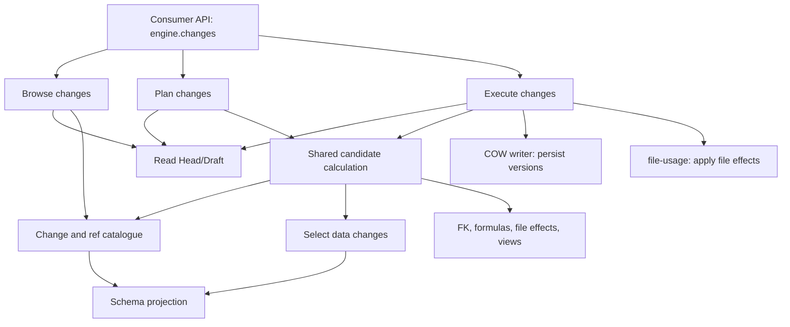

# Draft Changes: API, modules, and PR plan

Status: approved. Stages 1–6 are merged in PRs
[#66](https://github.com/revisium/revisium-engine/pull/66),
[#67](https://github.com/revisium/revisium-engine/pull/67), and
[#69](https://github.com/revisium/revisium-engine/pull/69), followed by
[#70](https://github.com/revisium/revisium-engine/pull/70),
[#71](https://github.com/revisium/revisium-engine/pull/71), and
[#73](https://github.com/revisium/revisium-engine/pull/73).
The next stack implements stages 7–9.

## Scope

- Consumers browse, plan, and execute full or partial commit/discard of uncommitted
  Draft changes, including the user-defined JSON schema.
- The PostgreSQL schema stays unchanged. Existing APIs, including `createRevision`,
  `revertChanges`, and `revisionChanges`, retain their behavior.
- Partial commit preserves the final user state of Draft; discard preserves Head
  and independent Draft edits. Existing snapshots remain immutable.
- Planning performs no writes. Stale plans apply no changes; execution failures
  roll back all writes, including file associations and history.

## Public API

Adds `engine.changes`. Type names below are abbreviated; exact structures and
signatures are in the [acceptance contract](../../src/__tests__/integration/draft-changes/support/contract.ts).

```ts
draftChanges(branch): Promise<Snapshot>
draftChangedTables(branch, page?): Promise<Connection<ChangedTable>>
draftChangedRows(branch, tableId, page?): Promise<Connection<ChangedRow>>
draftTableChanges(branch, tableId): Promise<TableChanges>
draftRowChanges(branch, tableId, rowId, page?): Promise<RowChanges>

planDraftChanges({ branch, operation, selection }): Promise<Plan>
draftChangesPlanDetails(branch, planToken, groupRef, page?): Promise<PlanDetails>
executeDraftChanges({
  branch, planToken, requestId, requiredAcknowledgmentToken?, message?,
}): Promise<ExecutionResult>
```

- `branch = { projectId, branchName }`; `operation = 'commit' | 'discard'`.
- `selection = { include, exclude? }`: all/table/rows/rowFields/schemaFields/change.
  Selections form a union; exclude denies effects. Exact refs distinguish reused
  public IDs; consumers do not pass `createdId`/`versionId`.
- Plan: ready/confirmationRequired/blocked/empty. Additional user changes require
  confirmation through `requiredAcknowledgmentToken`; execution receives the plan
  token without repeating selection.
- Execution: applied/replayed/stalePlan/blocked. Data paths use JSON Pointer;
  row creation/deletion, files, and arrays are atomic. Formula outputs are not
  independently selectable.

## Glossary and ownership

Head is the latest committed state; Draft is the working state. A snapshot is a
consistent read of state. A fingerprint covers actual data, metadata, and Head/Draft
roles; stored hashes or revision IDs alone do not establish freshness. A candidate
is a calculated state before persistence. A blocker explains why an operation
cannot proceed. COW (copy on write) reuses unchanged versions during persistence.

- `draft-revision`: the COW writer persists a candidate into a mutable revision,
  links versions, and removes only detached versions. It has no selection/plan
  logic. Fully equivalent rows and tables reconnect to Head versions. It returns
  created versionIds; file accounting covers all final file-bearing versions,
  including reused versions. Blob IDs are collected before deletion.
- `draft-changes`: Head/Draft reads, the change/ref catalogue, partial-state
  calculation, user-schema projection, FK effects, browsing, and execution.
  These are separate responsibilities within one feature.
- The catalogue owns semantic diff, ref creation/resolution, and ID selection.
  Comparison uses `revision-changes` operations through its feature API. The
  catalogue PR includes the minimum extension of that boundary and preserves
  existing comparison methods.
- Existing formula, file, and view owners retain their domain rules. Candidate
  operations use their APIs or shared extracted operations; `draft-changes` must
  not reimplement their validation.
- Shared calculation validates both resulting states against ordinary engine
  rules. An invalid source Draft does not block discard that restores a valid result.
- `infrastructure/database`: the existing transaction runner. The executor owns a
  Serializable transaction; reads, freshness checks, and writes use its client.
  Planning and browsing read snapshots in RepeatableRead transactions. Active
  async user-schema migrations use the existing migration feature, without a new
  locking system or DDL.
- Commit uses the existing `draft-revision.commit` operation: the current Draft
  becomes Head, and one child Draft contains the remaining edits. Discard persists
  the calculated Draft without creating a revision; partial discard must not call
  full revert. Commit order: persist Head candidate and flag → commit → COW-write
  the remainder into the child Draft → existing `hasChanges` recompute. The flag
  and existing comparison remain consistent with reused Head versions.
- Preparing file effects performs no writes. File restoration, accounting, and
  cleanup use `file-usage` inside the executor transaction, without another upload.
  New references are registered after persistence. Detached-version and blob
  cleanup waits until both final states and their new references are saved.
- The consumer facade only invokes feature operations; it does not import other
  features' internal handlers. Public types are introduced with their consumer.

## Module dependencies

An arrow means "uses". Plan and execute share candidate calculation; browsing
and calculation share one catalogue for diff and refs.



## PR map

Numbers identify stages, not GitHub PRs. Dependencies are substantive; the stack
linearizes this graph in the order below.

| PR  | Module: input → output; substantive change                                                                                                                         | Depends on | Behavior to prove                                                                                    |
| --- | ------------------------------------------------------------------------------------------------------------------------------------------------------------------ | ---------- | ---------------------------------------------------------------------------------------------------- |
| 1   | COW writer: transaction + mutable revision + candidate + source versions → versions/links and created versionIds                                                   | —          | Unchanged versions are shared; state equal to Head reuses its versions; rollback                     |
| 2   | Snapshot reader: branch → consistent Head/Draft + fingerprint; existing migration guards                                                                           | —          | Detect edits with unchanged stored hash; active migration blocks reads                               |
| 3   | Schema projection: snapshot + schema history + schema effects → projections and remaining edits; defines the schema-effects representation reused by the catalogue | 2          | Tests pass effects directly; schema/data across renames; explain unrepresentable remainder           |
| 4   | Catalogue: snapshot + projection → semantic diff, kind/selectable, refs; selection → exact catalogue entries                                                       | 2, 3       | Separate migration effects from user edits; resolve reused IDs through refs                          |
| 5   | Data candidates: snapshot + operation + catalogue selection → intermediate Head/Draft data and schema states, without writes                                       | 3, 4       | Partial fields, include/exclude, create/delete/rename, mixed schema/data changes                     |
| 6   | Dependencies: snapshot + operation + catalogue selection → resolved Head/Draft candidates, required effects, automatic FK effects, or blockers                     | 5          | Cycles, reference renames, hard excludes; no invented user edits                                     |
| 7   | Formulas: candidate → validated and recomputed values                                                                                                              | 5          | Valid formulas in both resulting states                                                              |
| 8   | Files: candidate + version associations → validated file effects; apply through file-usage                                                                         | 1, 5       | Read-only preview; restore without upload; accounting rolls back with persistence                    |
| 9   | Views: schema/view changes → resulting views and required effects                                                                                                  | 5          | Preserve independent edits or require exact confirmation                                             |
| 10  | Changes reader: catalogue → change pages, refs, and details                                                                                                        | 4          | Bounded responses, pagination, stale cursors, ambiguous IDs                                          |
| 11  | Planner: selection → validated candidates, effects/blockers, plan token, and acknowledgment                                                                        | 5–9        | Read-only preview; exact acknowledgment; restorative discard                                         |
| 12  | Executor: plan token → atomic commit/discard, history, and result                                                                                                  | 1, 2, 11   | Freshness, rollback, concurrent writers, commit/commit and commit/discard; replay after its decision |
| 13  | Consumer integration: feature operations → engine.changes and exports                                                                                              | 10–12      | Existing API compatibility; complete acceptance after the replay decision                            |

## Implementation boundaries for stages 4–6

One `DraftChangesModule` registers the operations. Query handlers orchestrate named
calculations; input/result types live beside their queries. Each directory has one
owner, and existing schema history, lineage, and JSON Pointer operations are reused.

| Stage | Owners                                                                                                                                                        | Operation boundary                                                                                                                                                                                                                                            |
| ----- | ------------------------------------------------------------------------------------------------------------------------------------------------------------- | ------------------------------------------------------------------------------------------------------------------------------------------------------------------------------------------------------------------------------------------------------------- |
| 4     | `catalogue/`: identity pairing, lifecycle, schema effects, row fields, atomic boundaries, refs; `selection/`: entity/field selectors, union and hard excludes | Supplied snapshot and schema projections → catalogue; selection → exact entries and denied targets, including unchanged fields. Supplied-row comparison uses `RevisionChangesApiService`.                                                                     |
| 5     | `candidates/`: commit/discard policies, candidate preparation, table/row state, field values, resulting-data validation                                       | Selected schema projection → candidate preparation → data changes → resulting JSON-data checks or exact recoverable prerequisites. Full discard restores Head even when Draft history is invalid. State/value operations do not choose commit/discard policy. |
| 6     | `dependencies/`: original reference bindings, graph, rename effects, required effects, closure, exclusion policy                                              | Calculate candidates → inspect both states → expand exact existing effects → recalculate. Schema projection owns generated FK history; shared FK extraction follows existing engine rules. Persisted-revision SQL queries remain separate.                    |

Tests live under the feature's `__tests__/catalogue`, `selection`, `candidates`, and
`dependencies` directories, with support per concern. Each scenario proves one
behavior. PostgreSQL/API scenarios verify persisted histories and feature wiring.

Schema entries own their field's recorded effects. Ancestor moves update current
paths; a required parent effect remains an explicit prerequisite subject to excludes.

Data candidates remain intermediate (`migrationLedger: 'deferred'`) until the
export history is assembled and checked. `revisium_schema_table` meta-history and
`revisium_migration_table`
records are separate formats; their timestamps do not establish a one-to-one
mapping. The existing schema owner must calculate replayable export history for
both roles before a plan can become ready. Plan and execute share that read-only
operation; the executor persists its result. Split effects, renames, reused IDs,
and swaps require replay proofs before that operation is integrated.

Formula calculation is shared with the existing plugin owner. Data validation
inspects temporary recomputed values and leaves derived values in the returned
candidate for the formula operation to materialize and report. The existing
prohibition on combining `foreignKey` and `x-formula` remains unchanged. Formula
calculation preserves native fallback values and diagnostics, then validates the
resulting data against ordinary engine rules.

Formula-schema blockers identify a schema JSON Pointer, including `properties`
and `items`. Formula effects, evaluation diagnostics, and resulting-data blockers
identify a concrete data JSON Pointer, including array indexes.

## Implementation boundaries for stages 7–9

- `formulas/` materializes computed values, hashes, effects, and diagnostics for
  detached Head/Draft. The existing `plugin/formula` owner supplies the shared
  evaluator; intermediate data validation consumes it too. Candidates contain
  stored values; the changes reader uses native read projection for metadata
  references and their formulas.
- `files/` validates source file identity and project-scoped blobs, then prepares
  exact detached associations without writes. Applying file effects requires the
  caller's transaction and both saved states. Register all final file-bearing
  versions, including reused versions, before blob cleanup. The caller owns
  removal of detached row versions; `file-usage` owns blob status and accounting.
  File-slot initialization must precede final formula calculation when it changes
  an input that formulas read; PR order does not determine runtime order.
- `views/` projects original views and their independent edits onto each resulting
  schema. Keep the source snapshot and actual schema projection context; do not
  infer provenance from candidate field names. Native migration and validation
  operations remain shared with their existing owners.

View changes use the existing opaque `change` selector. Catalogue refs identify
the stable table, view ID, and component: lifecycle, name, description, search,
columns, sorts, or filters. Configuration arrays are atomic for selection, while
schema projection preserves independent edits within them. Default-view and
view-order edits have separate table-configuration refs. Table selection with
`rows: 'none'` includes views; row and schema-field selectors do not select view
edits. Required view effects obey explicit exclusions. Ambiguous restoration of
duplicate occurrences returns a blocker rather than choosing an occurrence.
Stored view-format version has its own scalar configuration ref; values are
preserved under the existing native rules.

## Open decisions and workflow

**Plan token: proposal for approval.** A self-contained signed handle binds branch,
Head/Draft roles and IDs, fingerprint, operation, normalized selection, rule version,
and exact effects/acknowledgment. Details are recomputed read-only and reject stale
handles. Engine configuration supplies a shared stable signing key. Configuration
shape, missing-key behavior, and token-size limits for large selections need
approval and a PoC before PR 11.

**Open: retries after a lost response.** The contract includes `requestId`,
`replayed`, `receiptId`, and prevention of repeated application. The PoC added
`DraftChangesReceipt`, conflicting with the unchanged-DB-schema constraint.
Before PR 12 approval, a separate PoC must establish a solution using the existing
schema, or a contract change needs explicit approval. Replay covers successful
applied results in the same branch with the same payload; a reused requestId with
a different payload is rejected. PR 12 and full acceptance in PR 13 are conditional:
receipt scenarios and dependent rollback/concurrency cases are blocked. Support
currently reads `DraftChangesReceipt`; its binding may change while retaining the
asserted guarantees, without weakening expectations.

After PR 0 approval, open 2–3 stack layers at a time, starting from fresh `master`.
Each layer includes active behavior tests (TDD); acceptance tests are enabled as
runtime becomes available. The executor rereads actual state and checks the
migration guard inside its transaction. Prove transactions and races on PostgreSQL
with synchronization; test worker recovery and full-fingerprint cost separately
with sparse changes on increasing data sizes. Lower layers do not depend on upper
layers. New layers, dependencies, storage, or API changes first update this plan.
Each layer passes existing CI; the user merges from the bottom up.
